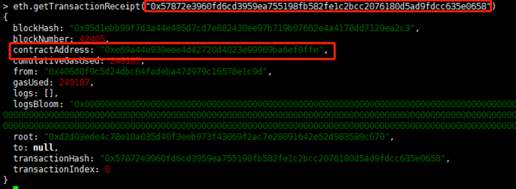

# **以太坊的智能合约**

## **什么是智能合约**
智能合约的原意是 Smart Contract。它在 wiki 上的定义是这样的：

> A smart contract is a computer protocol intended to digitally facilitate, verify, or enforce the negotiation or performance of a contract. Smart contracts allow the performance of credible transactions without third parties. These transactions are trackable and irreversible.

意思就是能由计算机协议来数字化的促进，验证，以及执行合同的内容。它能允许在没有第三方参与的前提下执行可信的交易，而且这些交易是可追踪并不可逆的。

光看定义还是比较模糊的，让我们先做一个简单对比：

合同 | 传统合约 | 智能合约
--- | --- | ---
合同主体 | 由自然人，法人或者机构构成的甲乙双方作为合同主体 | 由拥有数字身份的甲乙双方作为合同主体
合同条款 | 由甲乙双方协商定义，必须尽量详实并少歧义 | 由代码逻辑定义
合同执行 | 甲乙双方根据合同条款执行 | 计算机代为执行
合同仲裁 | 出现纠纷后需要经由第三方执法和仲裁机构完成仲裁 | 无仲裁机构

---

对于传统合约，因为条款都是由自然语言组成的，所以在条款的解释上会有一定概率出现歧义。这就导致甲乙双方对合约的理解出现偏差。同时，在出现纠纷时，需要可信的第三方作为仲裁和执法机构来解决纠纷，使得合约的执行成本增加。

与之对应的，智能合约的条款由程序定义。程序语言的逻辑往往只有一种解释，所以这就减少了歧义的可能性。智能合约的执行由程序来完成，所以只要双方执行的程序是一致且未被篡改的，且程序的内容是双方认可的，那么合约最后的执行结果也不容易出现纠纷。

> 现实中是否有类似智能合约的场景？ 有的，比如我们熟知的信用卡自动还款。定义好还款金额和时间作为合约的执行条件。当满足条件时，程序自动将一笔钱打到指定的信用卡账号，完成还款操作。

## **以太坊的智能合约**
上面提到的信用卡还款的例子其实还有个弊端。我们使用的还款程序是由第三方的机构提供的，由机构负责维护这个程序。我们需要把钱款托管给这个机构。这就必须有个前提，那就是这个机构必须是可信的，它不会偷偷修改程序的逻辑。

为了解决这个问题，`区块链 + 智能合约` 的概念被提出。由区块链的可追溯性和不可篡改性来保证智能合约的可靠。以太坊就是在满足这个概念的前提下被创造出来的。也正是因为实现了 `区块链 + 智能合约`，以太坊成为了被业界广泛认可的 区块链 2.0 代表。

### **合约的编辑, 编译和发布**
以太坊的合约使用 Solidity 语言编写。Solidity 是由以太坊核心团队发明，专门用于智能合约编写的一门编程语言。它的语法和 JavaScript 有点相似。具体可以浏览 [Solidity 官方文档](https://solidity.readthedocs.io/en/v0.4.21/)。同时推荐使用 Solidity 的在线编辑和编译器 [【Remix】](https://remix.ethereum.org/)。

合约在编辑完后需要编译成 bytecode。然后将 bytecode 以交易 Transaction 的形式发布到链上：
```javascript
eth.sendTransaction({
	from: '0x406d0f9c5d24dbc64fadeba47d979c16578e1c9d',
	data: '0x6060604052341561000f57600080fd5b6102e38061001e6000396000f30
		060606040526004361061004c576000357c01000000000000000000000000000
		0000...', 
	gas: '4700000'
})
```
以太坊的所有交易都可以用 Json 的形式来表示。上面的例子便是一个发布智能合约的交易。其中 `from` 字段表示交易的发起方，也就是合约的发布者。 `data` 字段表示合约的内容，以编译完成后的 bytecode 形式呈现。`gas` 字段表示交易发布者对于这笔交易所能承受的最大 gas 使用量。

交易发布出去后，会得到一个 tx hash，既交易的哈希。这个哈希便是这笔交易的唯一标识，用来做后续的检索。如果交易上链成功，则可以通过这个哈希查询到交易的收据（Receipt）：



如果你的交易是一个发布合约的交易，则可以在上述收据中的 `contractAddress` 字段处获得合约的地址。后续任何针对这个合约的操作都通过这个合约地址来达成。

### **合约地址**
以太坊的账号地址分为两种：`external` 和 `internal`。
- external 地址：普通的用户账号地址，由用户的私钥转化而成。用于对外标识用户的身份。
- internal 地址：智能合约的地址。在合约发布时，系统根据合约内容、合约的发布者等信息进行 hash 计算后所得。

两个地址都可以存储并转发以太币ETH，也可以对其他合约进行调用。从功能的角度来说，两者是没有区别的。这一特性也是智能合约能够 make sense 的基础之一。

### **合约执行**
以太坊通过 EVM + StateDB 的方式完成合约执行的动作。EVM 全称 Ethereum Virtual Machine，是以太坊上的虚拟机，用来执行编译好的合约代码。StateDB 用于存储每个账号地址的数据 State。State 包括账号的以太币余额，账号的合约状态等信息。

在合约上链成功后，合约代码会存储在链上，通过合约地址进行调用。这个调用也是以交易的形式发起：
```javascript
eth.sendTransaction({
	from: "0x406d0f9c5d24dbc64fadeba47d979c16578e1c9d", 
	to: "0x288109a11CE1BF18bDeE893559b4680C9C77889C", 
	data: "0xf9010b33843b9aca00830365d994288109a11ce1bf18bdee89		3559b4680c9c77889c80b8a40ae1b13d0000000000000000000000000		000000000000000000000040000000000000000000000000000000000...",
	gas: "0xea60"
});
```


