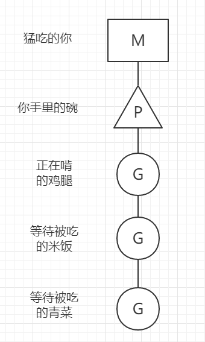

# **Goroutine**
这几年 GO 作为一门年轻的编程语言正变得越来越火。而语言层级的并发支持正是保证 GO 能被大众接受的主要原因之一。这篇文章将主要针对 GO 的 goroutine 进行研究和分析。

## **并发与并行**
在提起并发的时候，往往都会伴随着并行的概念一起讨论。那么两者都是什么，又有什么区别呢？

- **并发**：一个 worker 交替执行多个任务。
- **并行**：多个 worker 同时执行多个任务。

这么解释还不够直观。举个例子：

> 假设你正在吃完饭。你只有一张嘴，嘴就是你当前的 worker。现在有两个任务：吃完手中的米饭和喝完边上的汤。一般你的做法就是吃一点饭，然后喝一些汤。因为你只有一张嘴，所以不能吃饭喝汤同时进行，只能两个动作交替着来。这个过程就是并发。那么并行呢？并行就是你可能有两张嘴，一张嘴用来吃饭，一张嘴用来喝汤，两个动作同时进行。这就是并行。

## **Goroutine**
goroutine 是 GO 程序的最小单元，相当于一个小任务。当有多个 goroutine 同时存在时，worker 会在 goroutine 之间切换。同一时间一个 worker 只处理一个 goroutine，过段时间后暂停当前 goroutine 换另一个 goroutine 进行处理，从而达到并发的效果。在每次暂停当前任务的时候，worker 会记录下当前任务（也就是 goroutine）的运行状态，从而保证在下次启动的时候能继续之前的操作。

在实际 coding 过程中，我们使用 `go` 关键词来创建并使用 goroutine：
```go 
go doSomething()
```
在上述代码执行后，系统会创建一个 goroutine。在这个 goroutine 中处理方法 `doSomething()` 中的代码逻辑。

这时候问题就来了，如果一个程序启动了多个 goroutine，那系统是怎么控制并调度 goroutine 从而达到并发的效果呢？

## **GO 的 M, P, G**
为了完成 goroutine 之间的调度，GO 定义了三种不同的角色 `M, P, G`：

- **M**：可以理解为线程，它维护了很多内核级别的元素。比如内存，随机数生成器等。
- **P**：处理器，用来处理 `G`。它会维护一个 `G` 队列，用来表示需要它执行的 `G`。我们可以将它理解为一个单核上的任务调度器。
- **G**: `G` 就是我们之前一直提到的 goroutine 了。

为了更好的理解这三个角色的关系和作用，我们可以继续拿吃饭举例子：

> 想象一下你正端着碗吃饭，现在你碗里盛放着鸡腿，米饭，青菜。另外桌子上还有些没有被放入碗里的各种食物。你需要做的就是将桌上和碗里的食物都消灭干净。

在这个例子中，“你”就是上文提到的 `M`。你手里的“碗”就是 `P`，用来盛放需要吃掉的“鸡腿米饭青菜”（`G`）。`你 + 碗 + 碗里的食物` 就是一个完整的 M,P,G 结构了：



这时，在饭桌上还有些别的食物，龙虾鲍鱼啥的。这些桌子上没放到碗里的就是全局的 `G`（后面会提到这些 G 哪来的）。在一场饭局中（系统中），如果只有一个人吃饭（只有一个处理器在处理）那么可能吃到天荒地老都吃不完。这时候就要召集一帮人来吃了（启动多个 `M-P` 结构来处理任务）。

TODO

## **Goroutine 调度**

TODO


